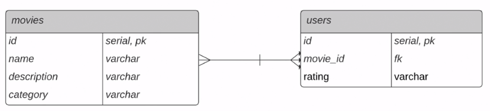

# Data-Engineering-Foundations

Prática do curso [Data Engineering Foundations](https://www.linkedin.com/learning/data-engineering-foundations).
Imagens de autoria do Instrutor [Harshit Tyagi](https://www.linkedin.com/in/tyagiharshit)

Tem como objetivo carregar dados de um dataset csv (https://www.kaggle.com/rounakbanik/the-movies-dataset) para um banco de dados, em seguida realizar operações ETL e gravar o dataframe spark resultando no banco.

